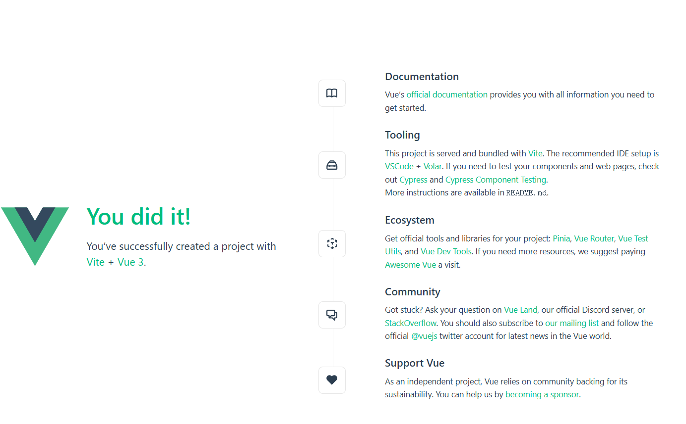

# 一、概述

Vue 是一款用于构建用户界面的 JavaScript 框架。它基于标准 HTML、CSS 和 JavaScript 构建，并提供了一套声明式的、组件化的编程模型，帮助你高效地开发用户界面。

该模板包含了一个简单的Vue.js官方示例 ，启动成功后将展示欢迎页。

**预装环境：**`Node v18.13.0`  `@vue/cli` `Extentions: Vue - Official`  `pnpm` `yarn` `node-gyp`  `git` 等。

注：npm & yarn默认配置了腾讯云仓库。

## 二、快速开始

使用如下命令，快速运行一个Vue.js程序：

```
// 安装依赖
yarn
// 启动应用程序
yarn run dev --host 0.0.0.0
```

**输出结果：**



### 三.  文件结构

```
workspace/
├── extensions.json   // 插件配置
├── .vscode 
│   └── preview.yml   // Cloud Studio 配置文件（运行、预览等）
├── public           
│   └── ...
├── src        
│   └── assets    
│   └── components    // 组件
│   └── App.vue       // 入口文件
│   └── main.js       
├── .gitignore   
├── package.json      // 包依赖引用配置
├── rollup.config.js  // Leafer Js 配置文件（端口，入口文件名等）
├── README.md         // 项目说明文档
├── img               // readme图片目录
|   └── ...                
```

### 2.  Vue.js 官方文档与资源

[Vue.js 官网](https://cn.vuejs.org/)

[Node.js — 在任何地方运行 JavaScript](https://nodejs.org/zh-cn)

[npm官网](https://www.npmjs.com/)

[yarn官网](https://www.yarnpkg.cn/)

## 三、  常见问题

[Cloud Studio（云端 IDE） 常见问题-文档中心-腾讯云](https://cloud.tencent.com/document/product/1039/33505)

[Cloud Studio（云端 IDE） | Cloud Studio](https://ide.cloud.tencent.com/docs/)

[Cloud Studio 轻量版 帮助文档](https://docs.qq.com/aio/DRUFZcHVvZlJuY3l2?p=1QOiTiIR9g0KMJneBDyfgM)

## 帮助和支持

##### 欢迎加入Cloud Studio用户反馈群

当您遇到问题需要处理时，您可以直接通过到扫码进入Cloud Studio用户群进行提问.

- 腾讯云工程师实时群内答疑

- 扫码入群可先享受产品上新功能

- 更多精彩活动群内优享


